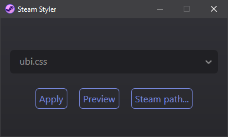
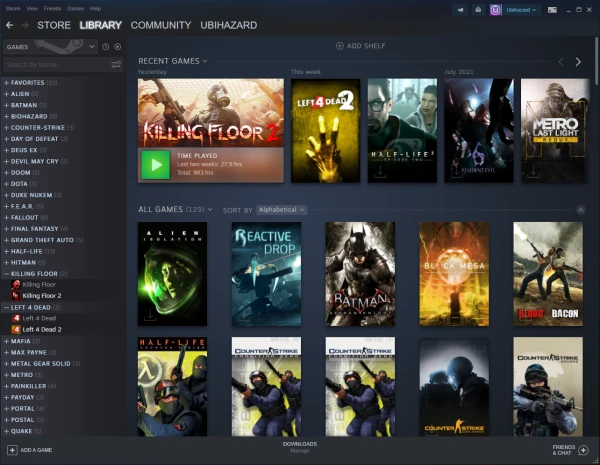
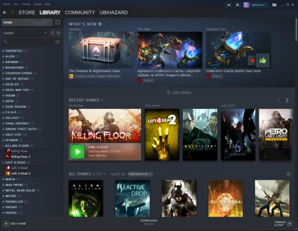

<p align="center"></p>
<h1 align="center">Steam Styler</h1>

<!--


Steam Styler
============
-->

*This utility has become obsolete. Valve is now protecting Steam CSS files from changes, making it much harder to apply custom CSS styles. __You can still use this tool,__ but every time you restart Steam it will redownload the entire client to restore original CSS files, forcing you to run Steam Styler again, creating an endless loop of Steam updates each time you restart it, which is not a good user experience.*

*As for me, I’ve simply reverted to using small library mode (just a list). I recommend using your desktop browser (not Steam client integrated browser) to actually browse the store, workshop, market, and manage your account. You will have to login twice, but it turned out to be very convenient because you can now use tabs to manage multiple Steam views and you won’t have to deal with forced marketing bullshit spam from Valve in your library.*

Steam CSS theme switcher. You can use this tool to manage Steam CSS customizations with ease and hide the obnoxious “What’s New” section from the library view.

Steam Styler is built as a [Microsoft HTML Application](https://learn.microsoft.com/en-us/previous-versions/ms536496(v=vs.85)) (HTA), which means it is open by nature, very lightweight, and doesn’t depend on any huge runtime.

Also check out [Left 4 Dead launcher](https://github.com/ubihazard/l4d-launcher) built using similar approach.

How to use
----------

Download the [latest release](https://github.com/ubihazard/steam-styler/releases) and unzip its contents into any directory. Run `install.bat` to create a shortcut in Start menu. Press <kbd>Win</kbd> key and launch **Steam Styler**.



**Steam** must be running first before running this tool.



You can see all currently available styles in the [gallery](https://github.com/ubihazard/steam-styler/tree/main/gallery#available-styles "Style previews").

Steam will revert back to original look <del>with each update</del> on each restart. So you will need to run Styler again to re-apply your style.



Configuration
-------------

Steam Styler must be pointed to the original Steam CSS file in order to be able to modify it. Use “Steam CSS...” button to point it to the correct CSS file. For example:

```bat
C:\Program Files (x86)\Steam\steamui\css\1010.css
```

The correct CSS file can be determined by trial and error, from the folder mentioned above. Note that future Steam updates can and do change CSS file names, so you might need to re-target different CSS file after a particular Steam update.

### Clean uninstall

Run `uninstall.bat` and move the Steam Styler folder into recycle bin.

Command-line version
--------------------

The advantage of command-line version of this tool is that it allows to apply styles quickly without going through GUI.

Create a shortcut to `styler.jse` script file and rename it to “Steam Styler (Re-apply)”. Right-click the created shortcut and go to “Properties” tab. Change the “Target” field as follows:

```bat
C:\Windows\System32\wscript.exe //E:JScript //NoLogo "C:\Steam Styler\styler.jse"
```

Start in:

```bat
C:\Steam Styler
```

(Assuming you extracted Styler into `C:\Steam Styler`.)

Change the shortcut icon to Styler icon included in the download. Click `Apply` and `OK` to dismiss the dialog.

Press <kbd>Win+E</kbd> to open Windows Explorer, then press <kbd>Ctrl+L</kbd> to change location and go to `%APPDATA%\Microsoft\Windows\Start Menu\Programs`. Copy the shortcut file you created into this location and delete the original.

### Apply styles directly

The configured (in GUI version) style can be overriden by providing it as a command line argument at the end of the shortcut target field:

```bat
cd /d "C:\Steam Styler"
wscript.exe //E:JScript //NoLogo styler.jse ubi.css
```

⭐ Support
---------

If you like [Steam Styler](https://github.com/ubihazard/steam-styler), you can [buy me a ☕](https://www.buymeacoffee.com/ubihazard "Donate")!
